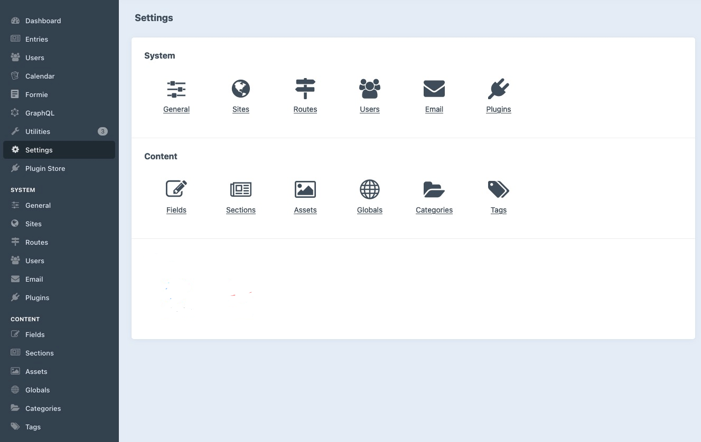

# Sidebar Admin Links plugin for Craft CMS 4.x

Add links from Settings directly to the sidebar for admin users.

Save yourself some clicks!

## Requirements

This plugin requires Craft CMS 4

For Craft 3, see the [Craft 3 branch](https://github.com/danieltott/craft-sidebar-admin-links/tree/craft3)

## Installation

To install the plugin, follow these instructions.

1.  Open your terminal and go to your Craft project:

        cd /path/to/project

2.  Then tell Composer to load the plugin:

        composer require danieltott/craft-sidebar-admin-links

3.  In the Control Panel, go to Settings → Plugins and click the “Install” button for Sidebar Admin Links.

Brought to you by [Dan Ott](https://dtott.com)
